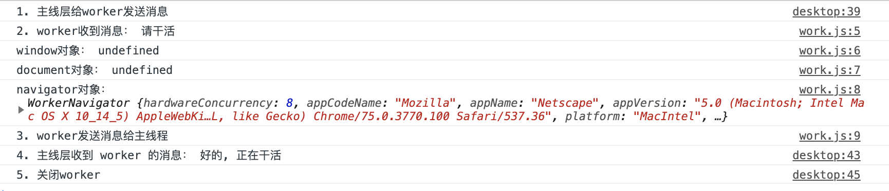
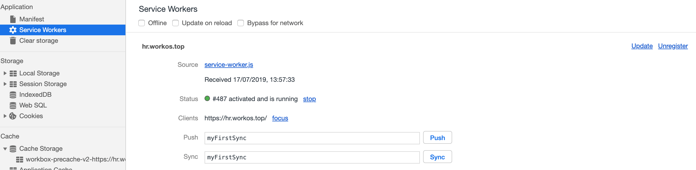
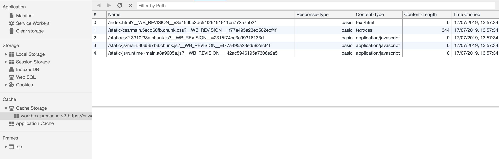

# Service Worker Document

Service Worker 简明分享

## Service Worker 和 PWA 的关系

Service Worker 是浏览器的一个功能，PWA 是一个理念或标准，用来规范离线 Web 的行为。

## Web Worker

在说明 Service Worker 的使用方式之前，我们先简单说一下 Web Worker

Web Worker 具体的细节可以参考阮一峰的：[Web Worker 使用教程](http://www.ruanyifeng.com/blog/2018/07/web-worker.html)；这里只做基本的介绍:

Web Worker 的作用，就是为 JavaScript 创造多线程环境，允许主线程创建 Worker 线程，将一些任务分配给后者运行。在主线程运行的同时，Worker 线程在后台运行，两者互不干扰。等到 Worker 线程完成计算任务，再把结果返回给主线程。这样的好处是，一些计算密集型或高延迟的任务，被 Worker 线程负担了，主线程（通常负责 UI 交互）就会很流畅，不会被阻塞或拖慢。

比较重要的点有：

###

### 同源限制

分配给 Worker 线程运行的脚本文件，必须与主线程的脚本文件同源。

### DOM 限制

Worker 线程所在的全局对象，与主线程不一样，无法读取主线程所在网页的 DOM 对象，也无法使用 document、window、parent 这些对象。但是，Worker 线程可以 navigator 对象和 location 对象

### 通信联系

Worker 线程和主线程不在同一个上下文环境，它们不能直接通信，必须通过消息完成。

### 示例

index.html:

```html
<script>
  var worker = new Worker('./work.js');
  console.log('1. 主线层给worker发送消息');
  worker.postMessage('请干活');

  worker.onmessage = function(event) {
    console.log('4. 主线层收到 worker 的消息：', event.data);
    worker.terminate();
    console.log('5. 关闭worker');
  };
</script>
```

work.js:

```js
self.addEventListener(
  'message',
  function(event) {
    console.log('2. worker收到消息：', event.data);
    console.log('window对象：', typeof window);
    console.log('document对象：', typeof document);
    console.log('navigator对象：', navigator);
    console.log('3. worker发送消息给主线程');
    self.postMessage('好的, 正在干活');
  },
  false,
);

// worker 如果要加载其他js资源，使用 importScripts
importScripts('....');
```

以上对象打印的日志：



我们已经知道 Web Worker 是什么，现在再来描述一下 Service Worker

## Service Worker

> (mozilla.org)[https://developer.mozilla.org/zh-CN/docs/Web/API/Service_Worker_API/Using_Service_Workers] 官方解释：
> Service workers 本质上充当 Web 应用程序与浏览器之间的代理服务器，也可以在网络可用时作为浏览器和网络间的代理。它们旨在（除其他之外）使得能够创建有效的离线体验，拦截网络请求并基于网络是否可用以及更新的资源是否驻留在服务器上来采取适当的动作。他们还允许访问推送通知和后台同步 API。

Service Worker 运行在 worker 上下文，两者的区别：

| 行为            | Web Worker     | Service Worker    |
| --------------- | -------------- | ----------------- |
| 关闭当前标签    | 关闭进程       | 保留进程          |
| 代理请求        | 无法拦截和代理 | 可以代理请求      |
| Cache Storage   | 无             | 可以管理          |
| backgroud push  | 无             | 可以接收消息      |
| background sync | 无             | 可以在后台同步    |
| 安全要求        | 无             | 必须由 HTTPS 承载 |

### Service Worker 运行步骤：

我们看看 Service Worker 是如何让用户做到秒开的：

1. 创建 Service Worker：Registration(注册) -> Installation(安装) -> Activation(激活)；此后会在浏览器中注册，此时可以在控制台 Application 中查看 Service Worker 的生命，它的生命周期随浏览器共存；
2. Service Worker 接管主线层请求，当请求的资源属于资源列表中的内容时，缓存到 Cache Storage；由于 Html 文件也可缓存，所以可以离线访问站点；
3. 当用户二度访问站点时(同源的所有标签都关闭之后，再次打开)，使用离线资源以打到秒开；并且 Service Worker 会在后台主动请求更新资源，以便下次访问时，用户使用新的资源版本；
4. 每 24 小时，Service Worker 会在后台主动请求更新资源；
5. 当异常状况发生时，主动注销 Service Worker

最终确保用户每次访问的都是本地离线资源

如图，我们可以在开发者工具的 Service Worker 选项中查看已注册的服务:


如图，我们可以在 Cache Storage 中查看缓存的内容:


### 注册 Service Worker 示例

index.html

```html
<script>
  window.addEventListener('load', function() {
    // 注册 service-worker.js
    navigator.serviceWorker.register('./service-worker.js', { scope: './' }).then((registration) => {
      // 安装
      if (registration.installing) {
        // Service Worker is Installing
      }
    });
  });
</script>
```

service-worker.js

```js
self.addEventListener('activate', function(event) {
  // 激活
});

self.addEventListener('fetch', function(event) {
  // 拦截主线层的请求, 匹配 URL
});
```

实际上，我们不需要去实现以上代码，大部分 PWA 项目使用了 GoogleChrome 团队编写的 workbox 去管理资源的请求拦截及缓存，create-react-app 创建的项目中已经内置了以下内容：

- 创建了 `serviceWorker.js` 文件，用于在主线程注册 Service Worker
- 在 Webpack 中使用了 WorkboxWebpackPlugin 插件，该插件帮我们处理了以下行为：
  - 生产环境编译时，生成 `precache-manifest.js` 列表，里面描述了需要被 Service Worker
  - 生产环境编译时，生成 `service-worker.js` 文件，内部使用 (workbox)[https://github.com/GoogleChrome/workbox]，配合 `precache-manifest.js` 去缓存文件

我们只需要在 index.js 中修改以下代码：

```js
// serviceWorker.unregister()
serviceWorker.register({
  onSuccess: () => {
    console.log('serviceWorker onSuccess');
  },
  onUpdate: () => {
    // 这里可以做一些操作，如提示用户已更新版本
    console.log('serviceWorker onUpdate');
  },
});
```

对 Service-Worker 管理不善或一旦你的静态资源文件出现问题，会对于线上业务造成毁灭打击，所以上线 Service-Worker 一定要做好强制更新的机制, 最基本的是确保历史的 serviceWorker 本身可以被卸载：

```js
// 每次都卸载之前的 serviceWorker
if (navigator && navigator.serviceWorker) {
  navigator.serviceWorker.getRegistrations().then(function(registrations) {
    for (let registration of registrations) {
      registration.unregister();
    }
  });
}
```

### 演示 Service Worker 更新及离线

这有一个开启了 Service Worker 的例子：[https://hr.workos.top](https://hr.workos.top)

1. 我们访问成功之后，关闭网络连接，看看离线访问的状态
2. 我们此时修改一下此文档代码并部署，看看 Service Worker 的更新机制

## 使用 Service Worker 条件

1. 需要在 https 中才可使用 serviceWorker；
2. 在微信浏览器中 serviceWorker 找不到；
3. ios 11.3 之后才支持 serviceWorker；
4. 如果用户在产品发版之后，并且 Service Worker 未主动获取新版本的时段访问站点，用户会使用历史版本，此时需要和确保后端接口兼容历史版本；
5. 要做一些异常情况的应急处理，如主动注销 Service Worker

## Thanks
